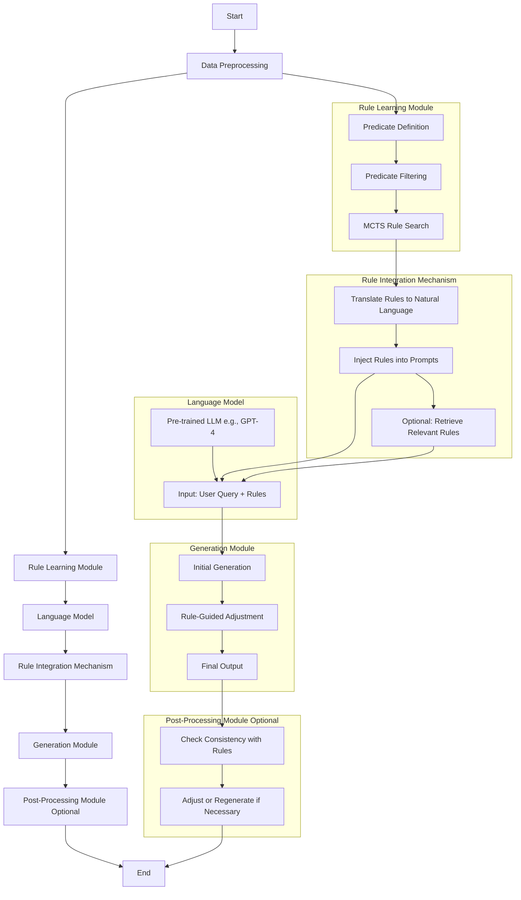

### RuAG 整体架构的详细设计

根据用户提供的查询和文档内容，以下是对 RuAG（Learned-Rule-Augmented Generation for Large Language Models）整体架构的详细设计说明。RuAG 是一种通过学习到的逻辑规则增强大型语言模型（LLM）生成能力的框架，旨在提高生成文本的质量、一致性和可控性。其核心在于结合符号AI的规则学习与神经网络的生成能力，形成一种混合架构。以下设计基于文档的具体内容（ICLR 2025 会议论文），分为关键组件、工作流程和实现细节。

---

## 关键组件

### 1. 规则学习模块

- **功能**：从训练数据中自动提取第一阶逻辑规则，用于指导语言模型生成符合任务需求的文本。
- **设计细节**：
  - **输入**：训练数据集（如文档中的 DWIE 数据集、HDFS 日志序列等），包括特征（离散或连续变量）和标签。
  - **过程**：
    1. **谓词定义**：利用 LLM（如 GPT-4）的常识推理能力，自动定义目标谓词（head predicates，例如分类任务中的标签）和体谓词（body predicates，例如数据集中的特征）。例如，在关系抽取任务中，目标谓词是特定关系（如 `member_of`），体谓词是其他相关关系（如 `player_of`）。
    2. **谓词筛选**：通过 LLM 提示（如文档中的 Figure A3），移除不相关的体谓词。例如，在日志异常检测中，移除与异常无关的属性（如用户 ID）。
    3. **规则搜索**：使用蒙特卡洛树搜索（MCTS）从数据中提取规则，详见后续模块。
  - **输出**：一组结构化的逻辑规则库，例如 `player_of → member_of`（精度 1.0）或 `E7, E15 → abnormal`（精度 1.0）。

### 2. 语言模型

- **功能**：作为生成文本的核心，利用预训练 LLM（如 GPT-4）执行下游任务。
- **设计细节**：
  - **模型选择**：基于任务需求选择合适的预训练模型。例如，文档中使用了 GPT-3.5 和 GPT-4。
  - **输入**：用户查询或任务上下文，结合规则库中的自然语言翻译版本。
  - **增强方式**：不直接微调模型，而是通过提示注入规则，保持模型的通用生成能力。

### 3. 规则整合机制

- **功能**：将学习到的逻辑规则与语言模型的生成过程无缝结合。
- **设计细节**：
  - **整合方式**：
    1. **生成前注入**：将规则翻译为自然语言（如 “If someone is a player of a team, they are a member of that team”），作为提示的一部分输入到 LLM。
    2. **生成后验证**：生成初步文本后，使用规则检查一致性，筛选或调整不符合规则的输出。
  - **技术实现**：
    - 在提示模板中嵌入规则（见文档 Figure A1）。
    - 可选地，根据上下文窗口大小检索最相关规则（见 Section 3.3）。

### 4. 生成模块

- **功能**：生成符合规则约束的高质量文本。
- **设计细节**：
  - **过程**：
    1. **初始生成**：LLM 根据输入上下文生成初步文本。
    2. **规则指导**：结合规则调整生成内容。例如，在关系抽取中，使用规则 `minister_of → agent_of` 推导出额外关系。
    3. **最终输出**：输出经过规则验证的文本。
  - **采样方法**：结合 top-k 或 nucleus sampling，并通过规则过滤候选结果。

### 5. 后处理模块（可选）

- **功能**：优化生成文本，确保其满足任务特定需求。
- **设计细节**：
  - **检查**：使用规则库验证文本的逻辑一致性（如关系抽取中的实体关系合理性）。
  - **修正**：对不符合规则的部分重新生成或调整。

---

## 工作流程

以下是 RuAG 的完整工作流程，基于文档 Section 3 的描述：

1. **数据预处理**
   
   - **输入**：原始数据集（如 DWIE 的 802 个文档，或 HDFS 的 486,060 条日志）。
   - **处理**：
     - 离散特征直接转换为布尔值。
     - 连续特征通过 Gini 指数离散化为布尔属性（见 Appendix C）。
   - **输出**：结构化的训练数据集。

2. **规则学习**
   
   - **输入**：预处理后的数据集。
   - **过程**：
     1. **谓词定义**：LLM 自动定义目标和体谓词。
     2. **MCTS 搜索**：
        - **状态**：部分逻辑规则（如 `[(age ≥ 30)]`）。
        - **动作**：添加新谓词（如 `Add (income ≥ $50,000)`）。
        - **奖励**：规则精度（如 0.85）。
        - **终止条件**：规则长度达上限（例如 5）或精度超阈值（例如 0.85）。
   - **输出**：规则库（如 Table A3 中的关系抽取规则）。

3. **语言模型微调（可选）**
   
   - **输入**：预训练 LLM 和规则库。
   - **过程**：通过提示注入规则，避免传统微调的高成本。
   - **输出**：增强后的生成能力。

4. **文本生成**
   
   - **输入**：用户查询（如关系抽取任务）。
   - **过程**：LLM 结合规则生成文本。
   - **输出**：初步文本。

5. **后处理（可选）**
   
   - **输入**：初步文本和规则库。
   - **过程**：检查和优化。
   - **输出**：最终文本。

---

## 具体实现细节

基于文档的实验部分（Section 4 和 Appendix C），以下是实现细节：

- **规则表示**：以第一阶逻辑形式存储（如 `E11, E28 → abnormal`），并翻译为自然语言。
- **MCTS 参数**：
  - **回合数**：500（见 Appendix C）。
  - **最大规则长度**：5。
  - **精度阈值**：0.85。
- **数据处理**：
  - 关系抽取：从 DWIE 数据集中提取 20 条规则，精度 > 0.5。
  - 日志异常检测：从 HDFS 采样 20,000 个日志块，按 8:1:1 划分。
- **模型选择**：默认使用 GPT-4，若无指定则为 GPT-3.5。
- **提示模板**：见 Figure A1（关系抽取）和 Figure A5（日志异常检测）。

---

## RuAG 的特点与创新

- **混合架构**：结合符号AI（MCTS 规则学习）和神经网络（LLM 生成）。
- **高效性**：通过自动化谓词定义和 MCTS 搜索，减少人工干预。
- **可解释性**：规则以自然语言形式呈现，便于理解和验证。
- **应用广泛**：适用于 NLP（如关系抽取）、时序预测（如日志异常检测）和决策任务（如 Alice&Bob 游戏）。

---

## 注意事项

本设计基于文档内容，未涉及未公开的超参数或具体代码。若需进一步优化，建议参考论文的 Appendix C 或实验设置部分，获取更多超参数配置（如 UCT 公式中的 C 值）。

希望此详细设计能满足您的需求！如需更深入讨论，请提供具体任务或补充信息，我将进一步完善设计。

---

根据您的查询，我将基于 RuAG（Learned-Rule-Augmented Generation for Large Language Models）的整体架构设计，提供完整的 Mermaid 流程图代码。以下代码详细展示了 RuAG 的关键组件及其工作流程，确保架构细节完整且直观易懂。

### Mermaid 流程图代码

### 架构设计细节说明

以下是对 RuAG 架构中每个模块的详细描述，帮助您理解其完整工作流程：

1. **数据预处理 (Data Preprocessing)**  
   
   - 功能：将原始数据集处理为结构化数据，为后续规则学习模块提供输入。
   - 输出：适合规则提取的格式化数据。

2. **规则学习模块 (Rule Learning Module)**  
   
   - **谓词定义 (Predicate Definition)**  
     - 使用预训练的大型语言模型（LLM）自动定义目标谓词和体谓词，作为规则的基础。
   - **谓词筛选 (Predicate Filtering)**  
     - 通过 LLM 的提示机制，移除不相关的体谓词，优化规则搜索空间。
   - **MCTS 规则搜索 (MCTS Rule Search)**  
     - 利用蒙特卡洛树搜索（Monte Carlo Tree Search, MCTS）从数据中提取逻辑规则，确保规则的高质量和高相关性。
   - 输出：一组逻辑规则。

3. **语言模型 (Language Model)**  
   
   - **预训练 LLM (Pre-trained LLM e.g., GPT-4)**  
     - 使用预训练的大型语言模型（如 GPT-4）作为核心生成引擎。
   - **输入：用户查询 + 规则 (Input: User Query + Rules)**  
     - 将用户查询与翻译后的规则结合，作为模型的输入。

4. **规则整合机制 (Rule Integration Mechanism)**  
   
   - **翻译规则到自然语言 (Translate Rules to Natural Language)**  
     - 将逻辑规则转换为自然语言描述，便于 LLM 理解和处理。
   - **注入规则到提示 (Inject Rules into Prompts)**  
     - 将翻译后的规则嵌入到输入提示中，指导 LLM 生成过程。
   - **可选：检索相关规则 (Optional: Retrieve Relevant Rules)**  
     - 根据上下文窗口大小或任务需求，动态检索与当前查询最相关的规则，提升效率。

5. **生成模块 (Generation Module)**  
   
   - **初始生成 (Initial Generation)**  
     - LLM 根据输入提示生成初步文本。
   - **规则指导调整 (Rule-Guided Adjustment)**  
     - 根据规则对初步生成的内容进行调整，确保符合逻辑约束。
   - **最终输出 (Final Output)**  
     - 输出经过规则校验的最终文本。

6. **后处理模块（可选） (Post-Processing Module Optional)**  
   
   - **检查一致性 (Check Consistency with Rules)**  
     - 使用规则库验证生成文本是否符合预定义的逻辑规则。
   - **调整或重新生成 (Adjust or Regenerate if Necessary)**  
     - 对不一致的部分进行修正或重新生成，确保输出质量。

### 数据流说明

- **从数据预处理到规则学习模块**：原始数据经过预处理后，进入谓词定义流程。
- **规则学习到规则整合**：MCTS 搜索得到的规则被翻译为自然语言并注入提示。
- **语言模型到生成模块**：用户查询和规则作为输入，生成初步和最终输出。
- **生成模块到后处理**：最终输出经过一致性检查和调整后完成。

### 注意事项

- 该流程图涵盖了 RuAG 的完整架构，适用于大多数任务场景。具体实现可能根据任务需求有所调整。
- Mermaid 代码可在支持 Mermaid 的平台（如 GitHub、Obsidian 或在线编辑器）中渲染为图形。
- 如果需要针对特定任务进一步细化子流程，请提供更多上下文，我将优化设计。

希望这份完整的 Mermaid 代码和说明能满足您的需求，帮助您清晰理解 RuAG 的架构设计！

---

根据论文的附录C（Implementation Details），以下是对RuAG（Learned-Rule-Augmented Generation for Large Language Models）框架的开发细节的详细设计。RuAG是一种通过学习到的逻辑规则增强大型语言模型（LLM）生成能力的框架，旨在提高生成文本的质量、一致性和可控性。以下设计涵盖了规则学习模块的谓词定义、谓词筛选、规则搜索（MCTS）、数据处理以及规则整合等关键部分。

---

## 1. 谓词定义模块

- **功能**：利用LLM的常识推理能力自动定义目标谓词（head predicates）和体谓词（body predicates）。
- **实现细节**：
  - **输入**：训练数据集（如DWIE数据集、HDFS日志序列等），包括特征和标签。
  - **过程**：
    1. **提示设计**：设计LLM的提示模板，引导LLM识别数据集中的关键特征和标签。例如，在关系抽取任务中，提示可以是“请识别以下数据集中关键的关系类型和相关特征...”。
    2. **LLM调用**：使用预训练的LLM（如GPT-4）生成目标谓词和体谓词。目标谓词通常是任务的标签（如关系类型），体谓词是与目标相关的特征。
    3. **谓词提取**：从LLM的输出中提取谓词，并进行格式化处理，确保其符合逻辑规则的结构要求（如`player_of`或`age ≥ 30`）。
  - **输出**：一组目标谓词和体谓词的列表，例如`{目标谓词: "关系类型", 体谓词: ["实体类型", "时间戳"]}`。

---

## 2. 谓词筛选模块

- **功能**：通过LLM的提示机制移除不相关的体谓词，优化规则搜索空间。
- **实现细节**：
  - **输入**：初始的体谓词列表。
  - **过程**：
    1. **提示设计**：设计提示模板，引导LLM评估每个体谓词与目标谓词的相关性。例如，“请判断以下特征与预测关系类型是否相关...”。
    2. **LLM评估**：使用LLM对每个体谓词进行相关性评分或分类，判断其是否与目标谓词相关。
    3. **筛选**：根据LLM的评估结果，移除评分低于阈值或被分类为不相关的体谓词。例如，在日志异常检测中，移除如“用户ID”这样与异常无关的属性。
  - **输出**：精简后的体谓词列表，例如`["实体类型", "时间戳"]`。

---

## 3. 规则搜索模块（MCTS）

- **功能**：利用蒙特卡洛树搜索（MCTS）从数据中提取高质量的逻辑规则。
- **实现细节**：
  - **输入**：精简后的体谓词列表、目标谓词、训练数据集。
  - **MCTS配置**：
    - **状态**：部分逻辑规则，如`[(age ≥ 30)]`。
    - **动作**：添加新的体谓词到规则中，如`Add (income ≥ $50,000)`。
    - **奖励**：规则的精度（accuracy），即规则覆盖的正例比例。
    - **终止条件**：规则长度达到上限（5）或精度超过阈值（0.85）。
    - **参数**：
      - 回合数：500
      - 最大规则长度：5
      - 精度阈值：0.85
  - **搜索过程**：
    1. **初始化**：从空规则开始。
    2. **选择**：使用UCT（Upper Confidence Bound for Trees）策略选择最有潜力的节点。
    3. **扩展**：在选定的节点上添加新的体谓词。
    4. **模拟**：从当前状态模拟到终止，计算奖励。
    5. **回溯**：更新搜索树中的节点统计信息。
  - **输出**：一组高质量的逻辑规则，例如`IF (age ≥ 30) AND (income ≥ $50,000) THEN employed = True`。

---

## 4. 数据处理模块

- **功能**：对连续特征进行离散化处理，以便于规则学习。
- **实现细节**：
  - **输入**：原始数据集中的连续特征（如年龄、收入）。
  - **过程**：
    1. **离散化方法**：使用Gini指数将连续特征离散化为布尔属性。Gini指数衡量分割后子集的纯度。
    2. **阈值选择**：对于每个连续特征，计算最佳分割点，使得分割后的子集Gini指数最小。例如，将`age`分割为`age ≥ 30`。
    3. **转换**：将连续特征转换为布尔特征，如`age ≥ 30`或`income < $50,000`。
  - **输出**：离散化后的数据集，适用于规则学习。

---

## 5. 规则整合模块

- **功能**：将学习到的逻辑规则整合到语言模型中。
- **实现细节**：
  - **输入**：学习到的逻辑规则。
  - **过程**：
    1. **规则翻译**：将逻辑规则翻译为自然语言描述。例如，`player_of → member_of`翻译为“如果某人是某个团队的球员，则他是该团队的成员”。
    2. **提示注入**：将翻译后的规则嵌入到LLM的输入提示中，作为生成文本的指导。例如，“根据以下规则生成文本：如果某人是某个团队的球员，则他是该团队的成员”。
    3. **可选：规则检索**：根据上下文窗口大小或任务需求，动态检索与当前查询最相关的规则。
  - **输出**：增强后的LLM输入提示。

---

## 6. 生成模块

- **功能**：利用增强后的LLM生成符合规则的高质量文本。
- **实现细节**：
  - **输入**：用户查询和注入规则的提示。
  - **过程**：
    1. **初始生成**：LLM根据提示生成初步文本。
    2. **规则指导**：在生成过程中，结合规则调整生成内容。例如，在关系抽取中，使用规则推导出额外关系。
    3. **采样方法**：结合top-k或nucleus sampling，并通过规则过滤候选结果。
  - **输出**：初步生成的文本，例如“John是Team A的球员，因此他是Team A的成员”。

---

## 7. 后处理模块（可选）

- **功能**：优化生成文本，确保其满足任务特定需求。
- **实现细节**：
  - **输入**：初步生成的文本和规则库。
  - **过程**：
    1. **一致性检查**：使用规则库验证文本的逻辑一致性。例如，检查“John是Team A的球员，但不是成员”是否违反规则。
    2. **调整**：对不符合规则的部分进行重新生成或调整。
  - **输出**：最终优化后的文本，例如“John是Team A的球员，因此他是Team A的成员”。

---

## 开发注意事项

1. **谓词定义和筛选的准确性**：确保LLM生成的谓词准确且与任务相关，避免引入噪声。
2. **MCTS参数优化**：根据任务复杂度调整回合数、规则长度和精度阈值，以平衡效率和质量。
3. **数据离散化**：选择合适的分割方法（如Gini指数），确保保留特征的关键信息。
4. **规则翻译**：确保翻译后的自然语言规则清晰且易于LLM理解。
5. **后处理机制**：实现高效的验证和调整流程，提升生成文本的可靠性。

---

通过以上详细设计，RuAG框架的开发细节得以明确，能够有效实现规则学习与语言模型增强的结合，适用于关系抽取、日志异常检测等任务。
