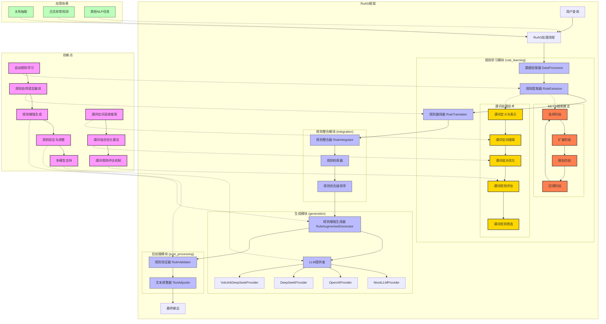

根据代码实例和项目结构，我将为您创建一个完整的项目架构图，突出RuAG框架的关键技术细节和创新点。

以下是使用Mermaid代码表示的项目架构：

## MCTS搜索算法详解

在RuAG框架中，蒙特卡洛树搜索(MCTS)算法是规则提取的核心技术，它通过以下四个阶段高效地在规则空间中搜索最优规则：

### 1. 选择阶段 (Selection)
- **UCB策略**: 使用上置信界(Upper Confidence Bound)策略平衡探索与利用
- **树遍历**: 从根节点开始，根据UCB值选择子节点，直到达到未完全扩展的节点
- **启发式函数**: 结合领域知识设计启发式函数，指导选择过程

### 2. 扩展阶段 (Expansion)
- **节点生成**: 为当前节点创建一个或多个子节点，每个子节点代表一个候选规则
- **谓词组合**: 通过添加新谓词或组合现有谓词生成新规则
- **剪枝策略**: 使用启发式剪枝策略减少搜索空间

### 3. 模拟阶段 (Simulation)
- **快速评估**: 对新扩展的节点进行快速随机模拟，评估规则质量
- **精确度计算**: 计算规则在训练数据上的精确度和覆盖率
- **早期终止**: 对明显低质量的规则进行早期终止，提高搜索效率

### 4. 回溯阶段 (Backpropagation)
- **结果更新**: 将模拟结果沿着路径回溯到根节点
- **节点统计**: 更新节点的访问次数和累积奖励
- **UCB更新**: 重新计算节点的UCB值，影响下一轮选择

### MCTS在规则学习中的优势
- **高效搜索**: 相比穷举搜索，MCTS能在更短时间内找到高质量规则
- **可扩展性**: 可以处理大规模规则空间，适用于复杂任务
- **理论保证**: 具有理论上的收敛性保证，能找到近似最优解
- **并行化**: 支持并行搜索，可充分利用多核处理器

MCTS算法与谓词处理技术相结合，构成了RuAG框架中规则学习的核心，使系统能够从数据中自动提取高质量的逻辑规则，为后续的规则增强生成提供坚实基础。

2. **规则自然语言翻译**: 将机器可读规则翻译为自然语言，提高可解释性和可理解性
  
3. **规则增强生成**: 将规则无缝整合到LLM生成过程中，引导模型生成符合规则的文本
  
4. **规则验证与调整**: 对生成文本进行规则验证，并在必要时进行调整，确保输出质量
  
5. **多模型支持**: 支持多种LLM模型，提高框架的通用性和适用性
  

### 应用场景

1. **关系抽取**: 从文本中提取实体关系，如"梅西效力于巴塞罗那足球俱乐部"
  
2. **日志异常检测**: 分析日志序列，检测异常事件
  
3. **其他NLP任务**: 框架设计具有通用性，可扩展到其他自然语言处理任务
  

这个架构图全面展示了RuAG框架的核心组件、技术流程、创新点和应用场景，突出了其在规则学习、规则整合、规则增强生成和后处理方面的技术细节。